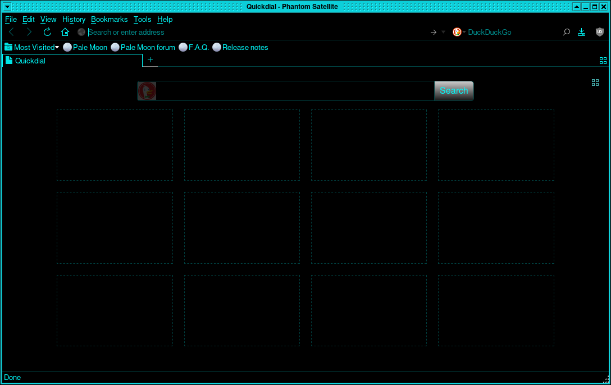

# Black Moon
 (Font is Servail's [CatseyeClearCode](https://github.com/Servail/fonts))

Black minimalistic palemoon theme with cyan accents, based on Servail's [blackmoon](https://github.com/Servail/blackmoon).

No colors, no round corners, almost no light. Extremely compact and easy on eyes. Very useful with linear gamma.

## Building
Simply download the contents of the "src" folder and pack the contents into a .zip file. Then, rename the file to .xpi and drag into the browser.

## Download
You can grab the latest release from the Releases section of this repository
